<div align="center">

<picture>
  <source media="(prefers-color-scheme: dark)" srcset="./assets/dark.svg">
  <source media="(prefers-color-scheme: light)" srcset="./assets/light.svg">
  
</picture>

<br>


<br><br>

<a href="https://gauthamk.netlify.app">

</a>

<a href="https://github.com/g4thxm">

</a>

<a href="https://linkedin.com/in/gauthamkrishnaj">

</a>

<a href="mailto:gauthamk357@gmail.com">

</a>

</div>

---

# 👨‍💻 About Me

```javascript
const gautham = {
    name: "Gautham Krishna J",
    location: "Kerala, India",
    education: "Bachelor of Computer Applications",
    role: "Full Stack Developer",

    currentlyWorkingOn: [
        "Laravel Applications",
        "REST APIs",
        "Personal Portfolio"
    ],

    currentlyLearning: [
        "Django",
        "Docker",
        "Cloud Computing",
        "Artificial Intelligence"
    ],

    technologies: [
        "Laravel",
        "PHP",
        "JavaScript",
        "Python",
        "MySQL"
    ]
};
```

---

# 🚀 Featured Projects

| Project | Description |
|---------|-------------|
| 📂 **Laravel File Tracking System** | Authentication, Role Management, Reports, CSV Import & Export |
| 🌐 **Personal Portfolio** | Modern responsive portfolio with animations and SEO |
| 🤖 **AI Projects** | Learning and building AI-powered applications |

---

# 🛠 Tech Stack

### Languages

<p align="center">


</p>

### Frameworks

<p align="center">


</p>

### Tools

<p align="center">


</p>

---

# 📊 GitHub Analytics

<p align="center">


</p>

<p align="center">


</p>

---

# 📈 Contribution Graph

<p align="center">


</p>

---

# 🐍 Contribution Snake

<p align="center">


</p>

---

# 🌱 Currently Learning

- 🚀 Advanced Laravel
- 🌐 Django
- ☁ Cloud Computing
- 🤖 Artificial Intelligence
- 🐳 Docker
- 🏗 System Design

---

# 🌍 Connect With Me

<p align="center">

<a href="https://gauthamk.netlify.app">


</a>

<a href="https://linkedin.com/in/gauthamkrishnaj">


</a>

<a href="https://instagram.com/iam._.gautham">


</a>

</p>

---

# 💬 Quote

> "Code. Learn. Build. Repeat."

---

<div align="center">

### ⭐ Thanks for visiting!


</div>
